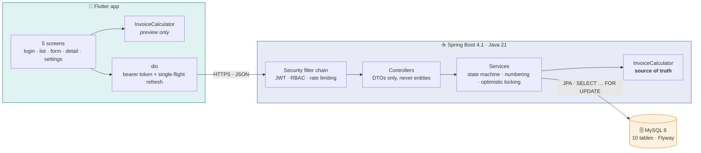
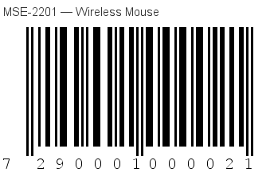
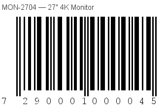
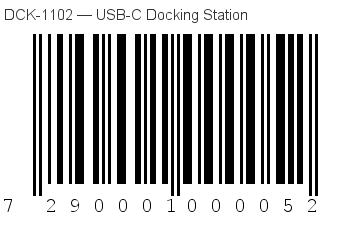
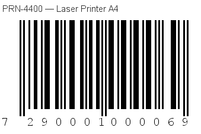
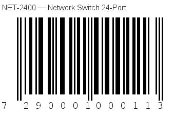
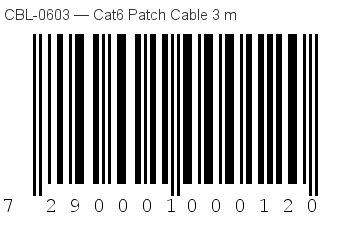
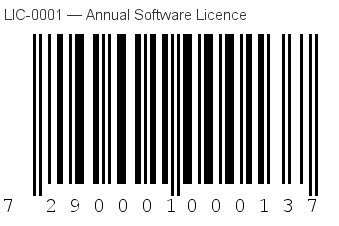
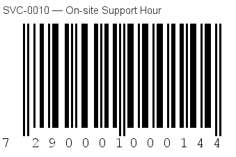
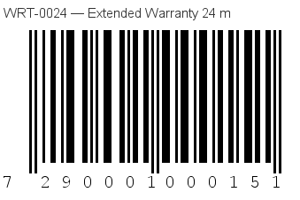

# Triosuite Invoices

An ERP sales-invoice system: a **Flutter** app on a **Spring Boot** REST API over **MySQL 8**.

Multi-currency invoicing with user-supplied exchange rates, tax-inclusive and tax-exclusive
calculation, server-side automatic numbering, an approval and cancellation lifecycle, and barcode
scanning — across exactly five screens.

Built for the Triosuite technical assessment. The full brief is in
[`AGENT_BRIEF.md`](AGENT_BRIEF.md).

---

## Jump to what you need

| | |
|---|---|
| 📱 **Install and try it** | [Reviewer quick start](#reviewer-quick-start) |
| 🗄️ **The SQL scripts** | **[`database/schema.sql`](database/schema.sql)** and **[`database/seed.sql`](database/seed.sql)** — see [Where everything lives](#where-everything-lives) |
| 📸 **Database screenshots** | [`database/screenshots/`](database/screenshots) |
| 🔌 **The REST API source** | [`backend/src/main/java/com/bsharat/triosuite/`](backend/src/main/java/com/bsharat/triosuite) |
| 📦 **The APK** | [`release/app-release.apk`](release/app-release.apk) |
| 📖 **API reference** | [`docs/API.md`](docs/API.md) · Swagger UI at `/swagger-ui.html` |
| 🧪 **Proof it works** | [`docs/SMOKE_TEST.md`](docs/SMOKE_TEST.md) |
| 🤔 **Why it is built this way** | [`docs/DECISIONS.md`](docs/DECISIONS.md) |

---

## Reviewer quick start

**1. Install the app.** Download [`release/app-release.apk`](release/app-release.apk) onto an
Android phone (Android 6.0 / API 23 or newer) and open it. Android will ask you to allow installing
from this source.

**2. Sign in.**

| Username | Password | Role | Can do |
|---|---|---|---|
| `admin` | `Admin#2026` | ADMIN | Everything — including cancelling invoices and editing settings |
| `sales` | `Sales#2026` | SALES | Read everything, create and edit drafts, approve. **Cannot** cancel or change settings |

Sign in as both. The difference is visible: the Cancel button simply is not there for `sales`, and
the Settings screen becomes read-only.

**3. Start the backend and point the app at it.** There is no hosted server — you run it, with
[one command](#one-command-on-windows-without-docker). Then tell the app where it is:

> **Settings → API address** → type the base URL → **Test connection** → **Save**
>
> The same button is on the "cannot reach the server" screen, which is where you first need it.

| Where the app runs | Address to enter |
|---|---|
| Android emulator on the same machine | `http://10.0.2.2:8080` |
| Phone on USB, after `adb reverse tcp:8080 tcp:8080` | `http://localhost:8080` |
| Phone on the same Wi-Fi | `http://<your PC's IP>:8080`, e.g. `http://192.168.1.50:8080` |

Find your PC's address with `ipconfig` on Windows or `ip addr` on Linux/macOS. The phone needs to be
on the same network as the PC — it does not need internet access.

**4. Things worth trying.**

- **Scan a barcode.** New invoice → **Scan** → point the camera at one of the
  [barcodes below](#barcodes-to-scan) on another screen. It adds the item; scan it again and the
  quantity goes up.
- **Watch the tax mode.** Switch Exclusive ↔ Inclusive on an invoice with lines. Exclusive adds tax
  on top; Inclusive extracts it from the price you typed. The total changes accordingly.
- **Change the currency.** Invoices start in JOD, the base currency, at three decimals — that is how
  the dinar is quoted. Switch to USD or EUR and every figure moves to two decimals, the exchange
  rate unlocks, and the lines are re-priced at it.
- **Approve an invoice.** It locks. The Edit button disappears, and a lock notice replaces it.
- **Cancel one** (as `admin`). It stays in the list under the **Cancelled** filter, with its lines,
  totals and approval stamp intact. Nothing is ever deleted.
- **Look at an invoice number.** You never typed one. The server allocates them, under a row lock,
  so two people creating invoices at the same moment cannot collide.

---

## Where everything lives

The assessment asks for specific deliverables. Here they are, by path.

| Deliverable | Path |
|---|---|
| **SQL script — schema** | **[`database/schema.sql`](database/schema.sql)** |
| **SQL script — demo data** | **[`database/seed.sql`](database/seed.sql)** |
| Schema description (`DESCRIBE`, `SHOW CREATE TABLE`) | [`database/schema_description.md`](database/schema_description.md) |
| How to run the scripts | [`database/README.md`](database/README.md) |
| **Database table screenshots** | **[`database/screenshots/`](database/screenshots)** |
| **REST API source** | [`backend/`](backend) |
| **APK** | **[`release/app-release.apk`](release/app-release.apk)** |
| Flutter source | [`mobile/`](mobile) |

The two SQL files are **byte-for-byte copies** of the Flyway migrations the application actually
runs (`backend/src/main/resources/db/migration/`). They exist separately so they can be read and run
on their own, and CI fails the build if the two ever drift apart —
[`scripts/check-sql-mirror.sh`](scripts/check-sql-mirror.sh).

---

## Architecture



The app computes totals on-device so the figures move as you type — but it is a **preview**. The
server recomputes every line and every total on each write and stores its own answer, and the
detail screen shows that. Both implementations use identical formulas and identical rounding, and
[each is tested against the same expected figures](#tests), so they cannot silently diverge.

### Stack

| | |
|---|---|
| **Backend** | Java 21 · Spring Boot 4.1.1 · Spring Security 7 · Hibernate 7 · Flyway 12 · springdoc-openapi 3 · jjwt |
| **Database** | MySQL 8.4 · InnoDB · utf8mb4 |
| **Mobile** | Flutter 3.44 · Dart 3.12 · GetX · dio · mobile_scanner · decimal · intl · flutter_secure_storage |
| **Build** | Maven wrapper · Gradle (Kotlin DSL) · GitHub Actions · multi-stage Docker |

---

## Running it locally

### One command, on Windows without Docker

Needs a **Java 21 JDK** and **MySQL Community Server 8** installed — nothing else, and no
configuration.

```powershell
.\scripts\run-local.ps1                 # API on 8080
.\scripts\run-local.ps1 -Port 8081      # or any free port
.\scripts\run-local.ps1 -SkipBuild      # reuse the jar from last time
.\scripts\run-local.ps1 -DatabaseOnly   # just the database, e.g. before ./mvnw verify
```

The **first** run creates a MySQL instance for this project — its own port (3307), its own data
directory under `%LOCALAPPDATA%\triosuite-mysql`, its own credentials — then creates the
`triosuite` and `triosuite_test` databases and the application user. It touches no MySQL already on
the machine and no data belonging to one. Every later run just starts it again.

Then it builds the API and runs it in the foreground: log on screen, `Ctrl+C` to stop. Flyway
creates and seeds the schema on the first boot. It refuses to start if the API port is taken, and
names the process holding it.

Open <http://localhost:8080/swagger-ui.html> and sign in as `admin` / `Admin#2026`.

> **Nothing here is a Windows service.** Both the MySQL on 3307 and the API are ordinary processes,
> so **both stop when the machine restarts** — run the script again.
>
> To make this project's MySQL survive a reboot, install it as a service once, from an
> **administrator** terminal:
>
> ```powershell
> & "C:\Program Files\MySQL\MySQL Server 8.4\bin\mysqld.exe" --install TriosuiteMySQL `
>       --defaults-file="$env:LOCALAPPDATA\triosuite-mysql\my.ini"
> Start-Service TriosuiteMySQL
> ```

Connection details, and how to start or rebuild that instance by hand, are in
[`database/README.md`](database/README.md).

### Everything at once, with Docker

```bash
cp .env.example .env      # then set MYSQL_ROOT_PASSWORD, DB_PASSWORD and JWT_SECRET
docker compose up --build

curl -sS localhost:8080/actuator/health     # {"status":"UP"}
```

Flyway creates and seeds the schema on first start; a second start is a no-op.

> The Docker artifacts were **not** run on the machine this was built on — hardware virtualization
> is disabled in its firmware, so Docker Desktop's backend cannot start. They are exercised by CI
> instead, which builds the image, brings the stack up and runs the smoke test against it. See
> [Known limitations](#known-limitations).

### Backend against your own MySQL

```bash
mysql -u root -p -e "CREATE DATABASE triosuite CHARACTER SET utf8mb4 COLLATE utf8mb4_0900_ai_ci;"

cd backend
DB_URL='jdbc:mysql://127.0.0.1:3306/triosuite?sslMode=DISABLED&allowPublicKeyRetrieval=true&characterEncoding=utf8&connectionTimeZone=UTC&forceConnectionTimeZoneToSession=true' \
DB_USERNAME=root DB_PASSWORD=yourpassword \
./mvnw spring-boot:run
```

The `local` profile carries development defaults, so with a MySQL on `127.0.0.1:3307` and the
credentials in [`database/README.md`](database/README.md), `./mvnw spring-boot:run` alone is enough.

### The app

**On an emulator** — `10.0.2.2` is how it reaches `localhost` on the host:

```bash
cd mobile
flutter pub get
flutter run --dart-define=API_BASE_URL=http://10.0.2.2:8080
```

**On a physical phone over USB** — the most reliable option, because `adb reverse` tunnels through
the cable and so does not depend on Wi-Fi or on your firewall allowing an inbound connection:

```bash
adb reverse tcp:8080 tcp:8080
cd mobile
flutter run --dart-define=API_BASE_URL=http://localhost:8080
```

**On a physical phone over Wi-Fi** — use the host's LAN address, and make sure the backend is not
bound to loopback only:

```bash
flutter run --dart-define=API_BASE_URL=http://192.168.1.50:8080
```

> **The APK in `release/` works for all three.** It permits cleartext HTTP, because the backend it
> talks to is one you run yourself and there is no HTTPS endpoint to point it at. Install it and set
> the address under **Settings → API address** — no rebuild, no `flutter run`.

### Changing the port

Everything is env-driven, so nothing in the repository needs editing:

```bash
cd backend
PORT=8081 ./mvnw spring-boot:run       # or: PORT=8081 java -jar target/*.jar
```

Then point the app at the new port — `adb reverse tcp:8081 tcp:8081` and
`--dart-define=API_BASE_URL=http://localhost:8081`, or just change it in the running app under
**Settings → API address**, which needs no rebuild.

### Building the APK

```bash
cd mobile
flutter build apk --release --dart-define=API_BASE_URL=https://your-api.example.com
cp build/app/outputs/flutter-apk/app-release.apk ../release/app-release.apk
```

To sign with your own key rather than the debug one:

```bash
keytool -genkeypair -v -keystore mobile/android/triosuite-release.jks \
    -alias triosuite -keyalg RSA -keysize 4096 -validity 10000

cat > mobile/android/key.properties <<'EOF'
storeFile=triosuite-release.jks
storePassword=<yours>
keyAlias=triosuite
keyPassword=<yours>
EOF
```

Both files are git-ignored. When `key.properties` is absent the release build falls back to the
debug key, so `flutter build apk --release` works for anyone who just wants to try it.

---

## API

Full reference: **[`docs/API.md`](docs/API.md)**. Machine-readable spec:
[`docs/openapi.json`](docs/openapi.json).

**Swagger UI is at `/swagger-ui.html`** on any running instance — the fastest way to explore this.
Call `POST /api/auth/login`, paste the `accessToken` into **Authorize**, and everything becomes
callable from the browser.

| | |
|---|---|
| Auth | `POST /api/auth/login` `/refresh` `/logout` · `GET /api/auth/me` |
| Reference | `GET /api/currencies` `/exchange-rates` `/customers` `/items` `/settings` |
| Barcode | `GET /api/items/by-barcode/{barcode}` |
| Invoices | `GET`/`POST` `/api/invoices` · `GET`/`PUT` `/api/invoices/{id}` · `POST` `/api/invoices/{id}/approve` `/cancel` |

Errors are RFC 9457 problem documents with a stable `code` — clients branch on that, never on the
message. There is deliberately **no delete endpoint**: an invoice that should not stand is
cancelled.

---

## Tests

```bash
cd backend && ./mvnw verify        # 48 unit + 82 integration
cd mobile  && flutter test         # 52
cd mobile  && flutter analyze      # clean, no ignore comments
```

**182 tests**, all passing.

| Suite | Count | What it proves |
|---|---|---|
| `InvoiceCalculatorTest` (Java) | 30 | Both tax modes, 2- and 3-decimal currencies, exact-half rounding, zero tax, fractional quantities, per-line rounding drift, `net + tax = gross`, base conversion. No Spring context. |
| `invoice_calculator_test.dart` | 30 | **The same expected figures**, against the Dart implementation — so changing one side without the other fails a build. |
| `InvoiceLifecycleIT` | 22 | Create, numbering and its per-year reset, update, approve, `INVOICE_NOT_EDITABLE`, `INVALID_TRANSITION`, `STALE_VERSION`, cancel, and that no delete endpoint exists. |
| `ApiSecurityIT` | 23 | Anonymous `401` on every protected route, tampered tokens, the SALES/ADMIN split, the actuator surface, security headers, and that no error leaks an internal name. |
| `api_contract_test.dart` | 15 | The app's real models and repositories against a **running API** — every field, enum, date and decimal, plus the full lifecycle from the app's side. |
| `CatalogIT` | 12 | Barcode found and not found, search across name/SKU/barcode, inactive customers excluded, pagination and its cap. |
| `AuthIT` | 10 | Login, wrong password, unknown username, refresh rotation, single-use refresh tokens, idempotent logout. |
| `InvoiceStatusTest`, `LoginRateLimiterTest` | 18 | The state machine as a closed table; rate-limit windows, expiry, per-username and per-IP scoping. |
| `InvoiceCalculationIT` | 8 | Both modes and JOD through the API; client-supplied totals ignored; tax rate taken from the catalogue. |
| `login_page_test.dart` | 7 | Validation, the show/hide toggle, the error path, and that no registration affordance exists. |
| `SeededInvoiceTotalsIT` | 3 | Every seeded invoice re-derived with the production calculator; every seeded EAN-13 check digit verified. |
| `LoginRateLimitIT` | 3 | Five failures then `429` + `Retry-After` — and that a *correct* password is refused too once the allowance is spent. |
| `InvoiceNumberingConcurrencyIT` | 1 | Twelve parallel creates receive distinct, gapless, sequential numbers. |

Integration tests run against a **real MySQL 8**, never H2 — the schema uses CHECK constraints,
`DATETIME(6)` and `SELECT … FOR UPDATE`, so anything else would be testing something other than
what ships.

### End to end

```bash
backend/scripts/smoke.sh                                   # localhost:8080
backend/scripts/smoke.sh https://your-api.example.com      # any deployment
```

Walks the whole reviewer journey and exits non-zero at the first thing that misbehaves. A recorded
run, with request and response bodies, is in [`docs/SMOKE_TEST.md`](docs/SMOKE_TEST.md) — including
the three real bugs it caught.

---

## Barcodes to scan

Every seeded item has a valid EAN-13. Open this on a second screen and scan from the app.

**All fifteen on one sheet:** [`docs/barcodes/all-barcodes.png`](docs/barcodes/all-barcodes.png)

| | | |
|---|---|---|
|  |  |  |
|  |  |  |
|  |  |  |
|  |  |  |
|  |  |  |

The last three are **zero-rated**, which is the quickest way to see tax handling behave correctly on
a mixed invoice.

Regenerate them with `java scripts/GenerateBarcodes.java` — it reads the codes out of `seed.sql` and
verifies every check digit before drawing, so the images cannot drift from the database.

---

## Database

Diagram: [`docs/ERD.md`](docs/ERD.md) · DDL: [`database/schema.sql`](database/schema.sql) ·
Column detail: [`database/schema_description.md`](database/schema_description.md)

Ten InnoDB tables in utf8mb4, with a foreign key and an index on every reference, and CHECK
constraints for the enum columns, non-negative amounts and positive quantities — so the data stays
correct even if a row is ever written by something other than this application.

Three conventions run through all of it:

- **Money is never a float.** `DECIMAL(19,4)` amounts, `DECIMAL(19,6)` rates, `DECIMAL(5,4)` tax
  rates, `DECIMAL(12,3)` quantities. `BigDecimal` in Java, `Decimal` in Dart.
- **Time is always UTC.** `DATETIME(6)`, ISO-8601 with a trailing `Z` on the wire, formatted to the
  device's locale by the app.
- **Nothing is deleted.** Invoice lines snapshot the item's name, barcode, price and tax rate, so an
  approved invoice renders identically in five years however the catalogue has changed.

### Screenshots

In [`database/screenshots/`](database/screenshots) — the structure of all ten tables, plus Flyway's
migration history, captured in MySQL Workbench's Table Inspector:

[`table_users.png`](database/screenshots/table_users.png) ·
[`table_refresh_tokens.png`](database/screenshots/table_refresh_tokens.png) ·
[`table_currencies.png`](database/screenshots/table_currencies.png) ·
[`table_currency_exchange_rates.png`](database/screenshots/table_currency_exchange_rates.png) ·
[`table_customers.png`](database/screenshots/table_customers.png) ·
[`table_items.png`](database/screenshots/table_items.png) ·
[`table_app_settings.png`](database/screenshots/table_app_settings.png) ·
[`table_invoice_sequences.png`](database/screenshots/table_invoice_sequences.png) ·
[`table_invoices.png`](database/screenshots/table_invoices.png) ·
[`table_invoice_lines.png`](database/screenshots/table_invoice_lines.png) ·
[`table_flyway_schema_history.png`](database/screenshots/table_flyway_schema_history.png)

---

## Deployment

This project is delivered to run **locally** — you start the API, the app talks to it over your own
network. Nothing is hosted, so there is nothing to pay for, keep awake, or let expire.

Hosting it is still a supported option, and fully written up if you want it:
**[`docs/DEPLOYMENT.md`](docs/DEPLOYMENT.md)** — two zero-cost routes with exact commands, the
expected output at each step, and a troubleshooting table. Free-tier terms were verified in
September 2026 and each claim links to its source.

- **Option A** — Render free web service + Aiven free MySQL. About 25 minutes, all in a browser.
- **Option B** — Oracle Cloud Always Free ARM VM with Docker and Caddy. Always on, no cold start.

The backend needs no changes to deploy: it honours `PORT`, runs as a non-root user, is tuned for a
512 MB container, migrates its own schema, and refuses to start in `prod` without its secrets.

---

## Key decisions

Full record with the reasoning: **[`docs/DECISIONS.md`](docs/DECISIONS.md)** — 13 entries.
The ones that shaped the most code:

- **Rounding is per line, half-up, to the invoice currency's minor units, and invoice totals are the
  sum of the already-rounded lines** — never a re-rounding of an unrounded sum. That keeps
  `Σ lines == invoice total` exactly, which is the first thing an auditor checks. Both
  implementations follow it identically.
- **Invoice lines snapshot the catalogue** rather than joining to it, because an approved invoice is
  a financial record and must not change when a price does.
- **Numbering uses a locked sequence row**, not `AUTO_INCREMENT`, which cannot restart per year or
  carry a prefix. Allocation happens under `SELECT … FOR UPDATE` inside the creating transaction.
- **Refresh tokens are opaque, hashed, single-use and rotated** — a JWT refresh token cannot be
  revoked, and revocation was a requirement.
- **The version check runs before the state-machine check**, so a caller working from a stale copy
  is told to reload rather than given an explanation of a state they have not seen.
- **Integration tests use a real MySQL, never H2**, because the DDL is MySQL-specific.


## Repository layout

```
├── backend/                  Spring Boot REST API
│   ├── src/main/java/…       controllers · services · entities · security
│   ├── src/main/resources/
│   │   ├── application.yml   local · test · prod, fully env-driven
│   │   └── db/migration/     V1__schema.sql · V2__seed.sql  ← the source of truth
│   ├── src/test/java/…       48 unit + 82 integration tests
│   ├── scripts/smoke.sh      the reviewer journey against any base URL
│   └── Dockerfile            multi-stage, JRE-only, non-root
├── mobile/                   Flutter app
│   ├── lib/core/             network · storage · theme · routing · money
│   ├── lib/features/         auth · invoices · settings
│   ├── test/                 unit · widget · contract
│   └── tool/                 launcher-icon generator
├── database/                 schema.sql · seed.sql · schema_description.md · screenshots/
├── docs/                     API · ERD · DECISIONS · SMOKE_TEST · DEPLOYMENT · PROGRESS · barcodes/
├── release/app-release.apk   signed release build
├── scripts/                  SQL mirror check · schema dump · barcode generator
├── docker-compose.yml        MySQL 8 + the API
└── .github/workflows/ci.yml  SQL mirror · backend · Docker · mobile
```

---

## Licence

MIT. Written by Abdalrahman Bsharat for the Triosuite technical assessment.
